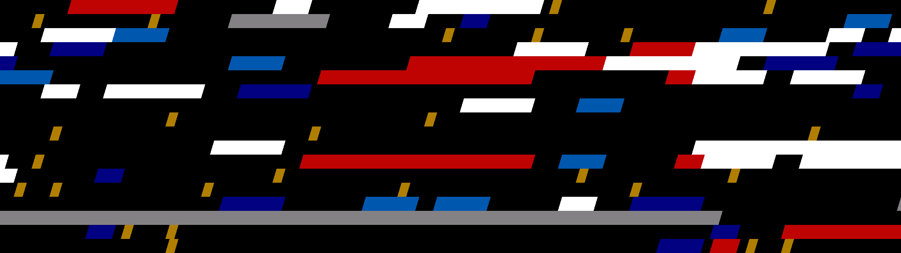

# bin_to_png
WIP
Convert binaries or source code into art.

This is mostly just a test to learn Ruby, and maybe produce some nice wallpapers as a byproduct.
So far it can generate art from rtf files (think, highlighted code).
Current command to generate said art:
`ruby rtf_to_png/tests/screen_test.rb [inputfile]`
the size can be set in `screen_test.rb`, the output is `test.png`

example image generated from feeding the script to itself:

## Dependencies

-   `chunky_png`
-   `Ruby-RTF`

work continues,
slowly
